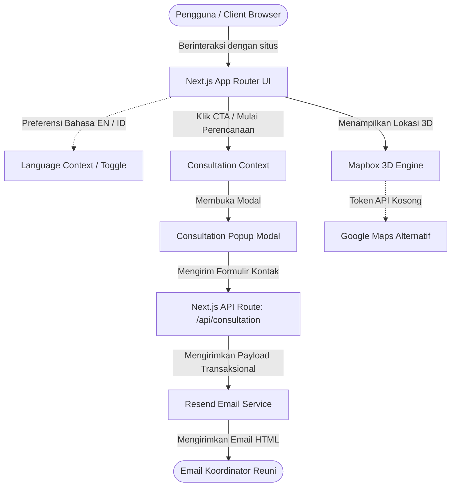

# 🌟 JumpaLagi (The Reunion Hub)

<!-- README-I18N:START -->

[English](./README.md) | **Bahasa Indonesia**

<!-- README-I18N:END -->

[](https://nextjs.org/)
[](https://react.dev/)
[](https://www.typescriptlang.org/)
[](https://tailwindcss.com/)
[](https://www.mapbox.com/)
[](https://resend.com/)

**JumpaLagi** adalah aplikasi web premium yang bernuansa nostalgia namun modern, dirancang untuk mempermudah perencanaan reuni keluarga, angkatan sekolah, maupun korporasi. Dibuat dengan aksesibilitas lintas generasi, platform ini menyediakan katalog paket pilihan (Bandung, Dieng, Solo), batas area lokasi, eksplorasi peta 3D interaktif, dan layanan konsultasi instan.

---

## 🗺️ Arsitektur Sistem

Diagram berikut mengilustrasikan interaksi antara komponen frontend, penyedia konteks global (context provider), API endpoint, dan layanan eksternal untuk menyajikan pengalaman pengguna di JumpaLagi:



---

## 📋 Pilihan Paket Destinasi Reuni

Kami menyediakan paket pilihan all-in-one yang disesuaikan dengan ukuran kelompok dan gaya liburan Anda:

| Paket | Kategori | Durasi | Harga (Mulai) | Fasilitas & Kelebihan |
| :--- | :---: | :---: | :---: | :--- |
| **Paket Bandung** | `PREMIUM` | 5 Hari, 4 Malam | `Rp 6,5 Jt / pax` | Pengalaman mewah di villa Lembang, tur pemandangan gunung, dan destinasi populer. |
| **Paket Solo** | `CULTURE` | 4 Days, 3 Nights | `Rp 4,2 Jt / pax` | Eksplorasi warisan budaya keraton, petualangan kuliner autentik, dan aktivitas nostalgia. |
| **Paket Dieng** | `NATURE` | 3 Days, 2 Nights | `Rp 3,2 Jt / pax` | Relaksasi di dataran tinggi sejuk, tur kawah & telaga warna, serta kumpul api unggun. |
| **Paket Custom** | `FLEXIBLE` | Fleksibel | *Sesuai Budget* | Rencana perjalanan kustom yang disesuaikan khusus dengan anggaran dan kebutuhan grup Anda. |

---

## 📂 Struktur Proyek

Berikut adalah gambaran umum dari direktori utama pada aplikasi ini:

| Direktori/File | Kegunaan |
| :--- | :--- |
| [`src/app/`](file:///c:/Users/KIKI/Desktop/JumpaLagi/jumpalagi/src/app) | Halaman Next.js App Router (home, about, contact, dan paket destinasi). |
| [`src/components/`](file:///c:/Users/KIKI/Desktop/JumpaLagi/jumpalagi/src/components) | Komponen UI interaktif (seperti Map3D, Navbar, ConsultationModal, PackageCatalog). |
| [`src/contexts/`](file:///c:/Users/KIKI/Desktop/JumpaLagi/jumpalagi/src/contexts) | Penyedia status global untuk preferensi bahasa aktif (EN/ID) dan pemicu modal. |
| [`src/templates/`](file:///c:/Users/KIKI/Desktop/JumpaLagi/jumpalagi/src/templates) | Templat HTML standar yang digunakan untuk mengirim notifikasi email melalui Resend. |
| [`next.config.ts`](file:///c:/Users/KIKI/Desktop/JumpaLagi/jumpalagi/next.config.ts) | Konfigurasi custom compiler Next.js dan fungsi pengalihan (redirect). |

---

## ⚙️ Langkah Awal & Pemasangan

Ikuti langkah-langkah di bawah ini untuk menjalankan proyek di perangkat lokal Anda:

1. **Pasang dependensi:**
   ```bash
   npm install
   ```

2. **Konfigurasikan variabel lingkungan Anda:**
   Buat file `.env.local` di folder utama proyek dan tambahkan kunci berikut:
   ```env
   # Konfigurasi Layanan Email
   RESEND_API_KEY=your_resend_api_key_here
   
   # Konfigurasi Peta 3D (Opsional, otomatis beralih ke Google Maps jika kosong)
   NEXT_PUBLIC_MAPBOX_ACCESS_TOKEN=your_mapbox_token_here
   ```

3. **Jalankan server pengembangan:**
   ```bash
   npm run dev
   ```

4. **Verifikasi:**
   Buka [http://localhost:3000](http://localhost:3000) pada browser Anda.

---

## 🚀 Panduan Deployment (Vercel)

Menyebarkan JumpaLagi ke produksi di platform Vercel sangat mudah dan andal:

> [!IMPORTANT]
> **Optimasi Regional Vercel**
>
> Untuk proyek dengan audiens di Asia Tenggara, selalu atur wilayah Vercel Function ke **Singapura (singapore-sin1)** atau **Singapore (sin1)** di dashboard proyek Anda. Ini meminimalkan latensi API untuk panggilan email dan database.

> [!TIP]
> **Catatan DNS Resend**
>
> Jangan lupa untuk mengonfigurasi catatan DNS domain Resend Anda (SPF, DKIM, dan DMARC) pada pendaftar domain Anda (misal Vercel Domains atau Cloudflare) untuk menjamin penerimaan email 100% masuk ke inbox.

---

## 📄 Lisensi

Proyek ini bersifat hak milik (proprietary) dan rahasia. Hak cipta dilindungi undang-undang.
