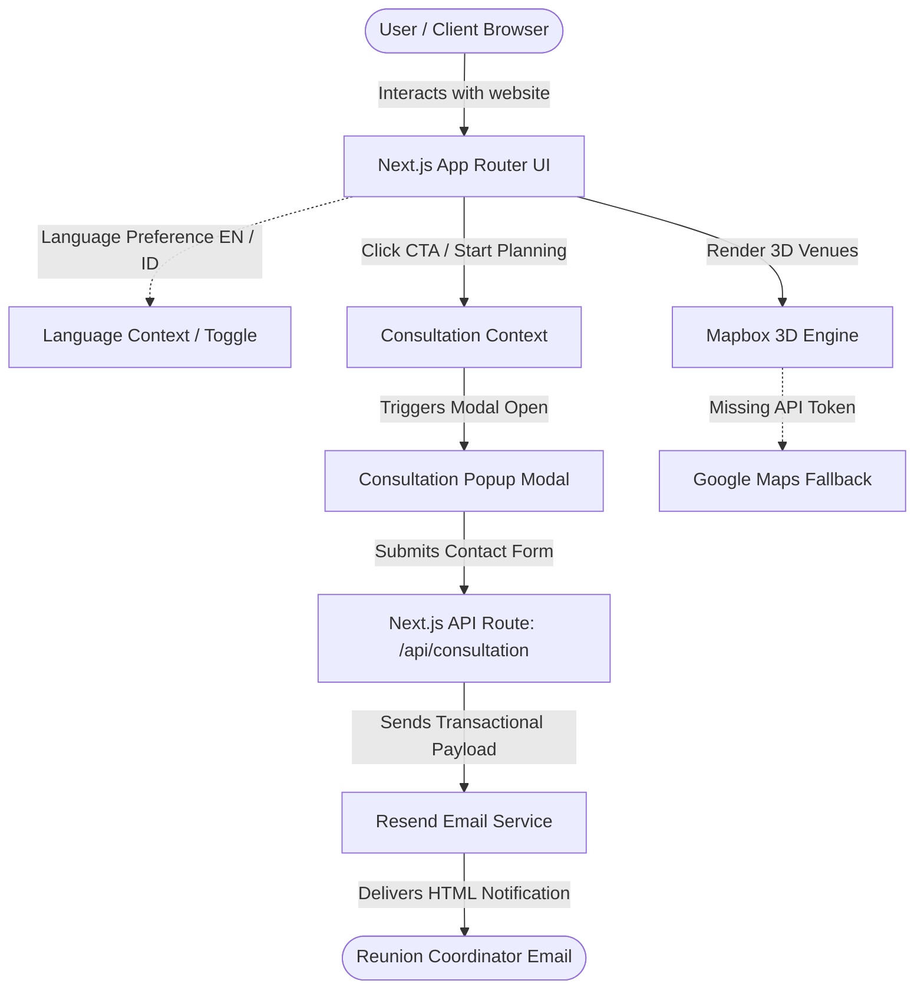

# 🌟 JumpaLagi (The Reunion Hub)

<!-- README-I18N:START -->

**English** | [Bahasa Indonesia](./README.id.md)

<!-- README-I18N:END -->

[](https://nextjs.org/)
[](https://react.dev/)
[](https://www.typescriptlang.org/)
[](https://tailwindcss.com/)
[](https://www.mapbox.com/)
[](https://resend.com/)

**JumpaLagi** is a premium, nostalgic, and modern web application engineered to facilitate seamless reunion planning for family, class, and corporate alumni groups. Designed with multi-generational accessibility in mind, it provides curated destination packages (Bandung, Dieng, Solo), venue outlines, interactive 3D map exploration, and instant consultation services.

---

## 🗺️ System Architecture

The following diagram illustrates how the frontend components, global context providers, API endpoints, and external services interact to orchestrate the JumpaLagi user experience:



---

## 📋 Reunion Destination Packages

We offer pre-packaged, all-inclusive options tailored to different group sizes and vacation styles:

| Package | Category | Duration | Price (from) | Highlights |
| :--- | :---: | :---: | :---: | :--- |
| **Paket Bandung** | `PREMIUM` | 5 Days, 4 Nights | `Rp 6,5 Jt / pax` | Luxury villa in Lembang, scenic mountain tours, and trendy local spot itineraries. |
| **Paket Solo** | `CULTURE` | 4 Days, 3 Nights | `Rp 4,2 Jt / pax` | Palace heritage tours, authentic culinary exploration, and nostalgic group activities. |
| **Paket Dieng** | `NATURE` | 3 Days, 2 Nights | `Rp 3,2 Jt / pax` | High altitude relaxation, crater & colorful lake excursions, and warm bonfire gatherings. |
| **Paket Custom** | `FLEXIBLE` | Adjustable | *Custom Budget* | Fully bespoke itinerary tailored specifically to your group's budget and style. |

---

## 📂 Directory Structure

Below is an overview of the key file structure of the application:

| Directory/File | Purpose |
| :--- | :--- |
| [`src/app/`](file:///c:/Users/KIKI/Desktop/JumpaLagi/jumpalagi/src/app) | Next.js App Router paths (home, about, contact, and package catalog pages). |
| [`src/components/`](file:///c:/Users/KIKI/Desktop/JumpaLagi/jumpalagi/src/components) | Interface components (e.g. Map3D, Navbar, ConsultationModal, PackageCatalog). |
| [`src/contexts/`](file:///c:/Users/KIKI/Desktop/JumpaLagi/jumpalagi/src/contexts) | State containers for active language (EN/ID) and consultation modal triggers. |
| [`src/templates/`](file:///c:/Users/KIKI/Desktop/JumpaLagi/jumpalagi/src/templates) | Standard HTML templates used to compile Resend email notifications. |
| [`next.config.ts`](file:///c:/Users/KIKI/Desktop/JumpaLagi/jumpalagi/next.config.ts) | Custom Next.js compiler settings and redirects. |

---

## ⚙️ Getting Started & Installation

Follow these steps to set up the project on your local machine:

1. **Install dependencies:**
   ```bash
   npm install
   ```

2. **Configure your environment variables:**
   Create a `.env.local` file in the root of the project and add the following keys:
   ```env
   # Email Service Configuration
   RESEND_API_KEY=your_resend_api_key_here
   
   # 3D Map Configuration (Optional, falls back to Google Maps if empty)
   NEXT_PUBLIC_MAPBOX_ACCESS_TOKEN=your_mapbox_token_here
   ```

3. **Start the development server:**
   ```bash
   npm run dev
   ```

4. **Verify:**
   Open [http://localhost:3000](http://localhost:3000) in your web browser.

---

## 🚀 Vercel Deployment Guide

Deploying JumpaLagi to production on Vercel is simple and reliable:

> [!IMPORTANT]
> **Vercel Regional Optimization**
>
> For projects targeting Southeast Asian audiences, always set the Vercel Function region to **Singapore (sin1)** in the project dashboard or in a `vercel.json` config. This minimizes API routing overhead for database and email service execution.

> [!TIP]
> **Resend DNS Records**
>
> Don't forget to configure your Resend domain DNS records (SPF, DKIM, and DMARC) on your custom domain registrar (e.g. Vercel Domains or Cloudflare) to ensure 100% email deliverability.

---

## 📄 License

This project is proprietary and confidential. All rights reserved.
